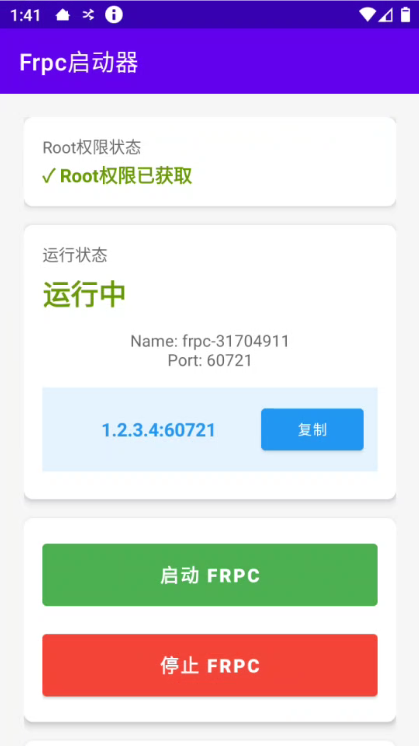
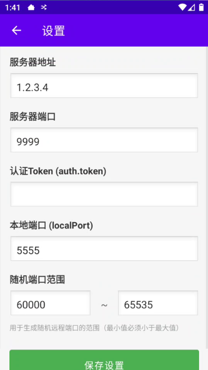
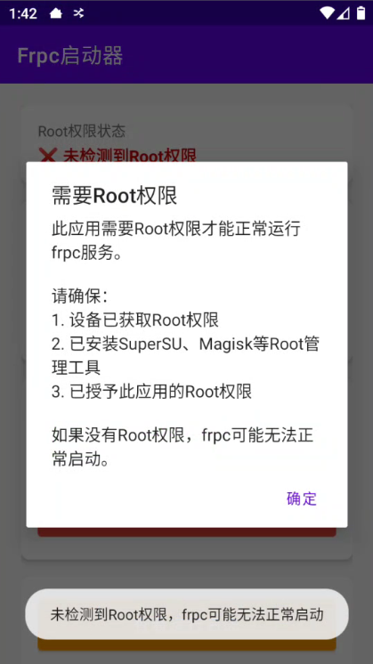

# Frpc启动器

一个用于Android设备的frpc客户端启动器应用，提供图形化界面来管理和配置frpc服务，实现内网穿透功能。

## 📥 下载

**APK下载地址**：[点击下载](https://luqiao.lanzouw.com/izr763d8o2gh)

## 📸 应用截图

<div align="center">











</div>

## 📱 功能特性

- ✅ **图形化界面**：简洁美观的Material Design界面，操作简单直观
- ✅ **一键启动/停止**：快速启动和停止frpc服务
- ✅ **实时日志查看**：独立的日志界面，实时显示frpc运行状态和输出
- ✅ **灵活配置**：支持自定义配置服务器地址、端口、认证Token等参数
- ✅ **端口范围设置**：可自定义随机端口生成范围（默认60000-65535）
- ✅ **连接信息显示**：自动显示服务器IP和穿透端口，方便快速连接
- ✅ **前台服务**：使用前台服务确保frpc进程稳定运行，防止被系统杀死
- ✅ **Root权限支持**：通过Root权限确保frpc进程正常运行
- ✅ **设置持久化**：配置信息自动保存，下次启动自动加载
- ✅ **关于页面**：显示应用信息和联系方式

## 🔧 系统要求

- **Android版本**：Android 5.0 (API 21) 或更高版本
- **Root权限**：必须（应用需要Root权限来执行frpc二进制文件）
- **网络连接**：需要能够访问配置的frpc服务器
- **frpc二进制文件**：需要将对应架构的frpc二进制文件放置在 `app/src/main/assets/frpc`

## 📁 项目结构

```
frp/
├── app/
│   ├── build.gradle              # 模块构建配置
│   ├── proguard-rules.pro        # ProGuard混淆规则
│   └── src/
│       └── main/
│           ├── AndroidManifest.xml           # 应用清单文件
│           ├── assets/
│           │   ├── frpc                      # frpc二进制文件（需自行添加）
│           │   └── frpc.toml                 # frpc配置模板
│           ├── java/com/frpc/launcher/
│           │   ├── MainActivity.java         # 主界面Activity
│           │   ├── FrpcService.java          # Frpc服务（核心逻辑）
│           │   ├── SettingsActivity.java     # 设置界面
│           │   ├── LogActivity.java          # 日志查看界面
│           │   ├── AboutActivity.java         # 关于界面
│           │   └── ConfigConstants.java       # 配置常量类
│           └── res/
│               ├── layout/                    # 布局文件
│               │   ├── activity_main.xml
│               │   ├── activity_settings.xml
│               │   ├── activity_log.xml
│               │   └── activity_about.xml
│               ├── values/                    # 资源文件
│               │   ├── strings.xml
│               │   ├── colors.xml
│               │   └── themes.xml
├── build.gradle                  # 项目构建配置
├── settings.gradle              # Gradle设置
├── gradle.properties            # Gradle属性
├── gradlew.bat                  # Gradle Wrapper (Windows)
└── gradle/                      # Gradle Wrapper文件
    └── wrapper/
        ├── gradle-wrapper.jar
        └── gradle-wrapper.properties
```

## ⚙️ 配置说明

### 默认配置

应用使用 `ConfigConstants.java` 统一管理默认配置值：

```java
// 服务器配置默认值
DEFAULT_SERVER_ADDR = "1.2.3.4"        // 服务器IP地址
DEFAULT_SERVER_PORT = 9999              // 服务器端口
DEFAULT_AUTH_TOKEN = "key123456"        // 认证Token
DEFAULT_LOCAL_PORT = 5555                // 本地端口（ADB端口）

// 随机端口范围默认值
DEFAULT_RANDOM_PORT_MIN = 60000         // 随机端口最小值
DEFAULT_RANDOM_PORT_MAX = 65535         // 随机端口最大值
```

### 修改默认配置

如需修改默认配置，编辑 `app/src/main/java/com/frpc/launcher/ConfigConstants.java` 文件中的常量值即可。

### 应用内配置

用户可以在应用的"设置"界面中配置以下参数：

- **服务器地址**：frpc服务器的IP地址或域名
- **服务器端口**：frpc服务器的端口号（1-65535）
- **认证Token**：frpc服务器的认证密钥（auth.token）
- **本地端口**：本地要穿透的端口（默认5555，用于ADB）
- **随机端口范围**：生成随机远程端口的范围（最小值必须小于最大值）

所有配置会自动保存到SharedPreferences，下次启动时自动加载。

## 🚀 使用方法

### 1. 准备frpc二进制文件

1. 根据目标设备的CPU架构下载对应的frpc二进制文件：
   - ARM64: `arm64-v8a`
   - ARM: `armeabi-v7a`
   - x86: `x86`
   - x86_64: `x86_64`

2. 将frpc二进制文件重命名为 `frpc`（无扩展名）

3. 将文件放置到 `app/src/main/assets/frpc`

4. 确保文件具有执行权限（在Linux/Mac上：`chmod +x frpc`）

### 2. 构建APK

#### 使用Android Studio

1. 打开Android Studio
2. 选择 `File` → `Open`，选择项目目录
3. 等待Gradle同步完成
4. 选择 `Build` → `Build Bundle(s) / APK(s)` → `Build APK(s)`
5. 构建完成后，APK位于：`app/build/outputs/apk/debug/app-debug.apk`

#### 使用命令行

```bash
# Windows
gradlew.bat assembleDebug

# Linux/Mac
./gradlew assembleDebug
```

构建完成后，APK位于：`app/build/outputs/apk/debug/app-debug.apk`

### 3. 安装和使用

1. **安装APK**
   - 将生成的APK传输到Android设备
   - 在设备上启用"未知来源"安装
   - 安装APK

2. **授予Root权限**
   - 首次运行时，应用会检测Root权限
   - 确保设备已Root并安装了Root管理工具（如Magisk、SuperSU等）
   - 授予应用Root权限

3. **配置服务器信息**
   - 打开应用
   - 点击"设置"按钮
   - 配置服务器地址、端口、认证Token等信息
   - 点击"保存设置"

4. **启动服务**
   - 返回主界面
   - 点击"启动"按钮
   - 应用会自动：
     - 从assets复制frpc二进制文件到系统临时目录
     - 生成随机端口（在配置的范围内）
     - 创建frpc配置文件
     - 使用Root权限启动frpc服务

5. **查看连接信息**
   - 主界面会显示运行状态
   - 显示连接信息：`服务器IP:穿透端口`
   - 点击"复制连接信息"可快速复制

6. **查看日志**
   - 点击"查看运行日志"按钮
   - 在日志界面可以：
     - 实时查看frpc输出
     - 清空日志
     - 复制日志到剪贴板

7. **停止服务**
   - 点击"停止"按钮停止frpc服务

## 🔨 构建配置

### 依赖库

- **AndroidX AppCompat**: 1.6.1
- **Material Design**: 1.11.0
- **ConstraintLayout**: 2.1.4
- **CardView**: 1.0.0

### 编译配置

- **包名**：`com.frpc.launcher`
- **最低SDK**：21 (Android 5.0)
- **目标SDK**：34 (Android 14)
- **编译SDK**：34
- **Java版本**：1.8

## 💡 技术实现

### 核心功能

1. **文件管理**
   - 从assets目录复制frpc二进制文件到应用目录
   - 使用Root权限将文件复制到 `/data/local/tmp` 并设置执行权限

2. **配置生成**
   - 根据用户设置动态生成frpc.toml配置文件
   - 使用时间戳和进程ID生成唯一的代理名称
   - 在配置的端口范围内生成随机端口

3. **进程管理**
   - 使用Root权限通过 `su` 执行frpc进程
   - 监控进程状态，捕获标准输出和错误输出
   - 通过BroadcastReceiver广播进程输出和状态

4. **前台服务**
   - 使用前台服务确保frpc进程不被系统杀死
   - Android 14+ 需要声明前台服务类型和理由
   - 在通知栏显示服务运行状态

5. **数据持久化**
   - 使用SharedPreferences保存用户配置
   - 配置修改后需要重启服务才能生效

### 关键类说明

- **MainActivity**：主界面，显示服务状态和连接信息，提供启动/停止按钮
- **FrpcService**：核心服务类，负责管理frpc进程的生命周期
- **SettingsActivity**：设置界面，管理所有配置参数
- **LogActivity**：日志查看界面，实时显示frpc输出
- **AboutActivity**：关于界面，显示应用信息和联系方式
- **ConfigConstants**：配置常量类，统一管理默认配置值

## ⚠️ 注意事项

1. **Root权限必需**
   - 此应用必须运行在已Root的设备上
   - 如果没有Root权限，frpc进程无法正常启动

2. **frpc二进制文件**
   - 必须根据设备架构准备对应的frpc二进制文件
   - 文件必须放置在 `app/src/main/assets/frpc`
   - 确保二进制文件与目标设备架构匹配

3. **网络连接**
   - 确保设备能够访问配置的frpc服务器
   - 检查防火墙和网络设置

4. **端口冲突**
   - 虽然应用会自动分配端口，但如果服务器端端口被占用，连接可能失败
   - 可以在设置中调整端口范围以避免冲突

5. **配置修改**
   - 修改配置后需要停止并重新启动服务才能生效
   - 应用会提示用户重启服务

6. **前台服务**
   - 应用使用前台服务运行，会在通知栏显示运行状态
   - 不要禁用应用的通知权限，否则服务可能无法正常运行

## 📝 更新日志

### v1.0
- ✅ 初始版本发布
- ✅ 支持图形化界面管理frpc服务
- ✅ 支持自定义配置服务器参数
- ✅ 支持实时日志查看
- ✅ 支持端口范围自定义
- ✅ 支持连接信息显示和复制
- ✅ 前台服务支持
- ✅ Root权限执行

## 👥 开发信息

- **作者**：神仙小分队
- **联系方式**：luqiao321@gmail.com
- **GitHub**：https://github.com/bsalee

## 📄 许可证

本项目仅供学习和研究使用。

## ❓ 常见问题

**Q: 应用提示"未检测到Root权限"怎么办？**  
A: 确保设备已Root，并安装了Root管理工具（如Magisk、SuperSU），然后授予应用Root权限。

**Q: frpc启动失败怎么办？**  
A: 检查以下几点：
- Root权限是否已授予
- frpc二进制文件是否正确放置在assets目录
- 网络连接是否正常
- 服务器地址和端口是否正确
- 服务器端frps服务是否正常运行

**Q: 如何修改服务器地址？**  
A: 在应用的"设置"界面中修改服务器地址和端口，然后保存。修改后需要停止并重新启动服务。

**Q: 端口范围可以修改吗？**  
A: 可以，在"设置"界面中可以修改"随机端口范围"的最小值和最大值。确保最小值小于最大值。

**Q: 为什么需要Root权限？**  
A: 因为需要将frpc二进制文件复制到系统目录（/data/local/tmp）并设置执行权限，这需要Root权限。

**Q: 应用可以在没有Root的设备上运行吗？**  
A: 不可以。应用的核心功能依赖于Root权限来执行frpc进程，没有Root权限无法正常工作。

